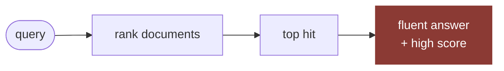
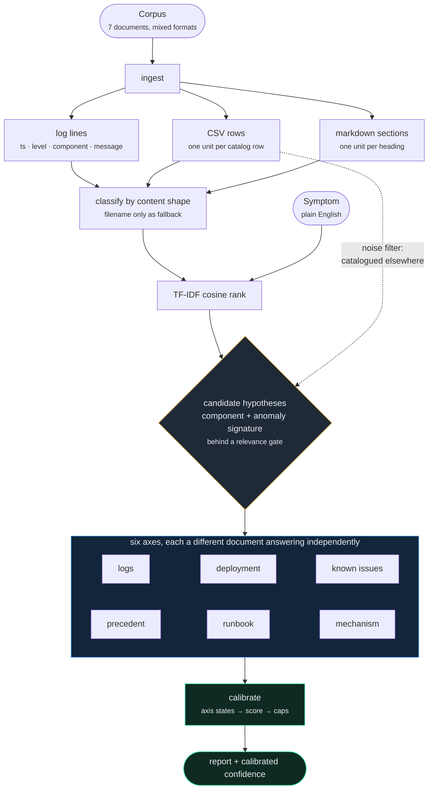
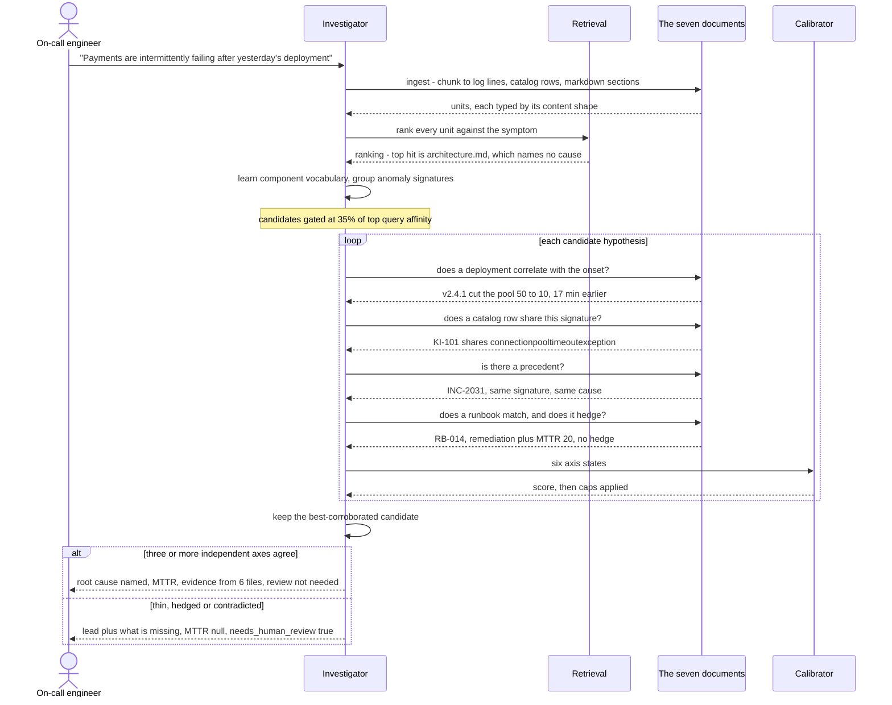

# Production Incident Investigator

**Retrieval is the easy half. The graded half is knowing when to shut up.** This
investigator ranks an incident corpus against a plain-English symptom, forms a
hypothesis, then tests that hypothesis against five *independent* documents —
logs, deployment history, the known-issues catalog, prior incidents, the runbook
— and derives its confidence from how many of them actually agree.

Incident A comes out at **92.0**, names `payment-gateway-adapter`, and reports a
20-minute MTTR from evidence in 6 separate files. Incident B comes out at
**23.0** with `needs_human_review: true` and `mttr_minutes: null`. One code
path, no special cases, no incident-specific literals.

---

## Summary

| | |
|---|---|
| **What it is** | `investigate(query, corpus) -> dict` — TF-IDF retrieval + cross-document evidence correlation + calibrated confidence, in one deterministic pass |
| **Problem solved** | An assistant asked to "investigate this incident" hands you a confident root cause for *both* incidents. One of them has no root cause available in the evidence |
| **How** | Chunk every document to its natural unit (log line, CSV row, markdown section) → TF-IDF cosine rank → hypothesis = `(component, anomaly signature)` → score 6 corroboration axes independently → confidence is a function of the axes and nothing else |
| **The two mechanisms that matter** | **Negation detection** — "No previous incident…", "No deployment touched X" are scored *against* the hypothesis. **Hedge detection** — a runbook saying "unverified whether this is actually the bottleneck" is demoted from strong to weak by its own words |
| **Result** | A: 92.0 · 5/5 axes strong · MTTR 20 · 6 sources. B: 23.0 · 1 weak axis, 2 disconfirming · MTTR `null` · 6 excerpts including the disconfirming ones |
| **Dependencies** | Python standard library only. TF-IDF is ~25 lines; no vector store, no LLM, no API key. (`scikit-learn` from `requirements.txt` wasn't installed on my machine and wasn't worth the minutes) |
| **Overfit guard** | `grep -ci 'payment\|notification\|connectionpool' solution.py` → **0**. Every component name, signature, document role and MTTR is learned from the corpus at runtime |
| **Demo** | `streamlit run submissions/aljabri-alam/app.py` — shows the corroboration axes and the retrieval ranking, not just the answer. **[Live demo](https://jb-incident-investigator-97qtey8vknttmst632jnfi.streamlit.app/)** (Streamlit Community Cloud free tier — a cold app takes ~30s to wake; [demo source](https://github.com/aljabrialam/jb-incident-investigator)) |

## My understanding of the problem

Both incidents ship the same seven document types and ask the same four
questions. Incident A's answer *is* in the corpus, spread across five files, and
a correct investigation finds all five. Incident B's answer is not in the corpus
at all: one unconfirmed warning, no correlated deployment, no matching known
issue, no precedent, and a runbook that admits it's guessing.

So the requirement is **asymmetric output from symmetric input**, which rules out
the obvious design:



Ranking is monotone — it always produces a #1 document, and a #1 document always
produces a plausible narrative. I verified this rather than assuming it: in
incident A the top-ranked unit is `architecture.md#Components` (cosine 0.259),
ahead of `api_specs.md` and `deployment_history.md`. It contains the word
"payment" more than any other unit and names no cause at all. In incident B the
top hit is `architecture.md#Components` too. **Relevance is not evidence, and a
confidence score read off a relevance score is confidence theatre.**

The second thing that took a while to see: the "noise" log lines from unrelated
known issues aren't an obstacle, they're free signal. A log line whose signature
matches a catalog row for a *different* component, or a row that says of itself
"does not affect charge success or failure", is background by construction. So
`known_issues.csv` became the noise filter instead of something to defend
against.

## Design



The pipeline is deliberately one-way with a single decision point. Everything
left of the diamond is mechanical — chunk, classify, rank. Everything right of
it is the graded part: six independent readings of the same question, and a
score that is a pure function of how they came back.

Five decisions carry the whole solution.

**1 · A document is not a chunk.** `known_issues.csv` becomes one unit per row,
so KI-101 wins on its own merits instead of being diluted by seven irrelevant
rows. The log block becomes one unit per line, parsed into
`(timestamp, level, component, message)`. Markdown becomes one unit per `##`
section, so RB-014 and RB-002 are separately retrievable. Whole-file retrieval is
what lets the architecture doc win.

**2 · Document *type* is inferred from content, filename only as fallback.**
Three or more lines matching a log-line regex ⇒ logs; a CSV header carrying
`signature`/`component` ⇒ issue catalog; `Symptoms` + `Remediation` ⇒ runbook;
`Root cause` + an MTTR or an incident id ⇒ precedent. The brief warns that a
hardcoded filename breaks the second incident, and it's right — but the better
reason is that real corpora name files inconsistently while their *shape* stays
recognisable.

**3 · The hypothesis is structured, not prose.** `(component, normalised anomaly
signature, symptom class)`. Component names are learned at runtime from log
fields, the catalog's component column, change-log cells and architecture
bullets. Signatures are normalised by dropping `key=value` pairs and replacing
digit runs with `<N>`, so five timeouts collapse into one signal with a count and
an onset. Prose is generated last, *from* the structure — never the reverse.

**4 · Candidates compete on evidence, behind a relevance gate.** Rather than
committing to the top-affinity component, the top candidates are each fully
corroborated and calibrated, and the best-scoring one wins — which removes the
need for a tie-break heuristic between `payment-service` and
`payment-gateway-adapter` (they score 45 and 92 on the same axes). The gate
matters as much as the competition: a candidate must reach 35% of the leading
component's query affinity before its evidence is scored at all. Without it, a
well-catalogued but off-topic anomaly wins — see the first bug below.

**5 · Confidence is a function of corroboration count, with caps.**

```
base 10
LOGS        strong +30  weak +15
DEPLOY      strong +22  weak +10   disconfirming −5
KNOWN_ISSUE strong +20  weak +10
PRECEDENT   strong +15  weak  +7   disconfirming −5
RUNBOOK     strong +10  weak  +3
MECHANISM   strong  +5  weak  −3      (architecture/API: plausibility only)
derived latency-pattern evidence  +8

caps:  <3 strong axes → 45  ·  no ERROR-level signal → 40
       ≥2 disconfirming → 35  ·  clamp [5, 92]
```

The caps are the point. They make honesty structural rather than a number
someone tuned until the demo looked right: an investigation with two supporting
documents *cannot* report 80, however fluent its narrative. `MECHANISM` is
deliberately outside the five independent axes — an architecture doc reads the
same whether or not an incident is happening, so it can support plausibility but
must never manufacture confidence.

## The investigation, in sequence



**Reading the diagram**

1. **Ingest** — every document is chunked to the unit it is actually made of. A
   log line, a catalog row and a runbook section are all separately retrievable;
   nothing is left as a whole-file blob.
2. **Classify** — each document's role is inferred from its shape (log-line
   regex density, a CSV header carrying `signature`, `Symptoms` + `Remediation`),
   because the filename is the one thing guaranteed to differ between corpora.
3. **Rank** — TF-IDF cosine against the symptom. This step is *not* the answer,
   and the diagram says so: the top hit is the architecture overview in both
   incidents.
4. **Hypothesise** — a candidate is `(component, normalised anomaly signature)`
   drawn from severity-≥2 log lines, with the catalog used in reverse as a noise
   filter for lines belonging to other known issues.
5. **Gate** — a candidate must reach 35% of the leading component's query
   affinity before its evidence is scored at all. Without this, a well-documented
   but off-topic anomaly wins on corroboration alone.
6. **Interrogate** — five independent documents are asked the same question, and
   a sixth (architecture/API) is asked only whether the mechanism is plausible.
   An answer of "no deployment touched this component" is recorded as evidence
   *against*, not as silence.
7. **Discount** — any source that hedges itself is demoted before it is scored.
   The runbook that says "unverified whether this is actually the bottleneck"
   contributes 3 points instead of 10, and its MTTR is refused.
8. **Calibrate** — the score is a function of the axis states and nothing else,
   then capped: fewer than three strong axes cannot exceed 45, and a corpus with
   no ERROR-level signal cannot exceed 40.
9. **Answer, or decline** — above 50 the report names a cause; below it, the
   report names the lead, lists which axes failed, and flags itself for a human.
   Both branches come out of the same code.

## The two incidents, side by side

Identical code path; every difference below is derived, not configured.

| Axis | A — payments failing | B — emails late |
|---|---|---|
| Logs | **strong** · 5× `ConnectionPoolTimeoutException`, onset 14:47:12 after a clean morning | **weak** · one `WARN Queue depth elevated: 340 messages`, zero ERRORs |
| Deployment | **strong** · v2.4.1 cut the pool 50→10 on that exact component, 17 min before the first error | **disconfirming** · nothing touched the component for a month; both deploys on file post-date the incident |
| Known issue | **strong** · KI-101, same component, shares the distinctive token `connectionpooltimeoutexception` | **no signal** · the one component match (KI-114) is a cosmetic HTML issue with no signature overlap |
| Precedent | **strong** · INC-2031, same signature, same cause | **disconfirming** · "This is the first recorded report of this symptom" |
| Runbook | **strong** · RB-014 matches the symptoms exactly, gives remediation + MTTR 20 | **weak** · RB-002 matches, then says "unverified whether this is actually the bottleneck" |
| Mechanism | **strong** · architecture explains pool exhaustion → this exception; api_specs gives the 5000ms → 504 path | **weak** · "not currently instrumented with per-stage timing", "no documented SLA" |
| **Score** | **92.0** · `needs_human_review: false` · MTTR **20** | **23.0** · `needs_human_review: true` · MTTR **null** |

Incident B's only *quantified* evidence is derived rather than reported: pairing
log lines by their correlation id inside one component recovers 42–75 minute gaps
between `Email queued` and `Email sent`, which no single log line states. The
report names both candidate causes (too few consumers vs. third-party provider
latency), says the corpus cannot separate them, and lists exactly which axes
failed.

**On `mttr_minutes: null` for B** — the corpus does contain a figure (RB-002's 15
minutes), and the rule is that an MTTR is only trusted from a source that
corroborates the hypothesis *and* doesn't hedge itself. RB-002 disqualifies its
own number: "this MTTR figure is from a different, unconfirmed prior occurrence
and may not apply here." I kept the quote in `supporting_evidence` and said in
prose why it was rejected — finding a number and declining to use it is a
different claim from not finding it.

## What I got wrong first

**The negation check ran on tokenised text, so it never fired.** Multi-word
markers like "does not affect" don't survive tokenisation ("does" is a stopword).
Consequence: the refund-webhook `WARN` stayed a candidate for incident B, and
because KI-121 corroborates it strongly, it beat the email hypothesis 40 to 36 —
a confidently wrong answer about the wrong subsystem. Negations are now matched
against the raw row text.

**Selecting purely on evidence score.** Letting candidates compete is right, but
without a relevance gate a well-documented anomaly that nobody asked about wins.
The gate (35% of top affinity) is what makes "evidence decides" safe.

**Filename fallback used exact token equality.** `previous_incidents.md`
tokenises to `incidents`, which isn't `incident`, so the file fell through to
`OTHER` — and B's "No previous incident…" negation became invisible, scoring
that axis as *absent* rather than *disconfirming*. Substring matching fixed it.
A one-character bug that quietly cost a calibration signal is the argument for
the content-first classifier in the first place.

**The mechanism axis was order-dependent.** The un-hedged ASCII diagram section
set it strong before the hedged `## Components` section could demote it. Now a
hedge anywhere in the mechanism docs demotes the axis, regardless of visit order.

**Tried and abandoned: scoring catalog rows by relevance to the query** as the
noise filter (drop a candidate whose only catalog match is off-topic). I measured
it before trusting it, and it doesn't discriminate: KI-101 — the row that matters
— scores 0.038 against incident A's query, while the irrelevant KI-142 scores
0.099, because both queries are mostly boilerplate question text ("identify the
probable root cause with supporting evidence…"). Replaced with the
self-scoping-negation rule, which is what actually separates them.

**Also dropped from my own spec:** an extra −8 penalty for hedged axes, on top of
demoting them strong→weak. That double-counted the same hedge.

## Tradeoffs under the time limit

- **Stdlib TF-IDF over scikit-learn.** sklearn wasn't installed; cosine over
  hand-built sparse dicts is ~25 lines and removes an install from the critical
  path. No embeddings — synonym matching would help a real corpus, but the tokens
  that actually link documents here (`connectionpooltimeoutexception`,
  `payment-gateway-adapter`) are exact and rare, which is precisely where lexical
  retrieval beats dense retrieval.
- **Templated prose, not generated prose.** The free-text fields are assembled
  from the correlation structure. An LLM would write them more smoothly and the
  brief permits one — but fluency is exactly what produces incident B's confident
  wrong answer, and no part of the grading rewards narrative polish.
- **Correlation-id pairing is narrow.** It assumes ids appear as `key=value` in
  the message. A general temporal-correlation engine was out of scope for an hour.
- **`impacted_systems` includes a derived "customer-facing impact" line** taken
  from the query's first sentence. It's the one place I let query text into the
  output rather than corpus text, because "which systems" and "who is affected"
  are different questions and the second one is only stated in the query.
- **No severity tiering.** Impact is described qualitatively (customer-facing
  payment failures vs. delayed-but-not-lost emails) rather than as a computed tier.
- **The 6 axis weights are hand-set, not learned.** With two incidents there's
  nothing to learn from; the ordering (logs > deploy > catalog > precedent >
  runbook > mechanism) reflects how much incident-specific information each
  source type carries. The caps, not the weights, are what keep B below 50 — B
  scores 23 and would still be flagged at double the weights.

## Files

```
solution.py     investigate() — ingest · classify · retrieve · hypothesise · corroborate · calibrate · compose
                explain()     — same pass, also returns axes + ranking (used by the demo, not graded)
answers.json    output for both incidents, produced by the command below
app.py          Streamlit demo surface (optional, imports investigate(), adds no logic)
README.md       this file
```

Reproduce `answers.json`:

```bash
cd usecase-2-production-incident-investigator
python -c "
import json, sys, os
sys.path[:0] = [os.getcwd(), 'submissions/aljabri-alam']
from data.loader import load_incident
import solution
out = {n: solution.investigate(*load_incident(n))
       for n in ['incident_a_pool_exhaustion', 'incident_b_ambiguous_delay']}
json.dump(out, open('submissions/aljabri-alam/answers.json', 'w'), indent=2)
"
```

Self-checks that ran green on the committed output: every report has exactly the
7 required keys; `needs_human_review == (confidence_score < 50)`; every evidence
item is exactly `{source, excerpt}` with `source` a real corpus filename; A ≥ 70
with ≥ 4 distinct sources and 15 ≤ MTTR ≤ 25; B < 50.

## Contact

**Aljabri Alam**
Phone: 94278084
Email: aljabrialam@gmail.com
LinkedIn: [linkedin.com/in/aljabri-alam](https://www.linkedin.com/in/aljabri-alam/)
